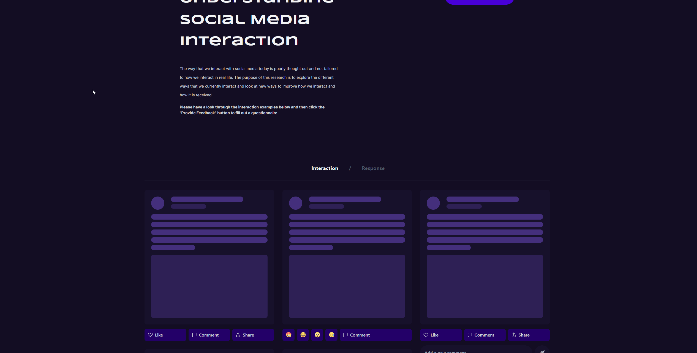

# Understanding Social Media Interaction

A website built to present the different options out there currently for interacting with social media, and an attempt to create new options that could improve the experience for everyone that is involved. Survey research was conducted alongside this artefact and as shown that most aren't keen to stray from the interaction that they are most familiar with.

### Screen capture

## Dev
To install 

`yarn` or `npm i`

To run 

`yarn dev` or `npm run dev`

To build 

`yarn build` or `npm run build`
